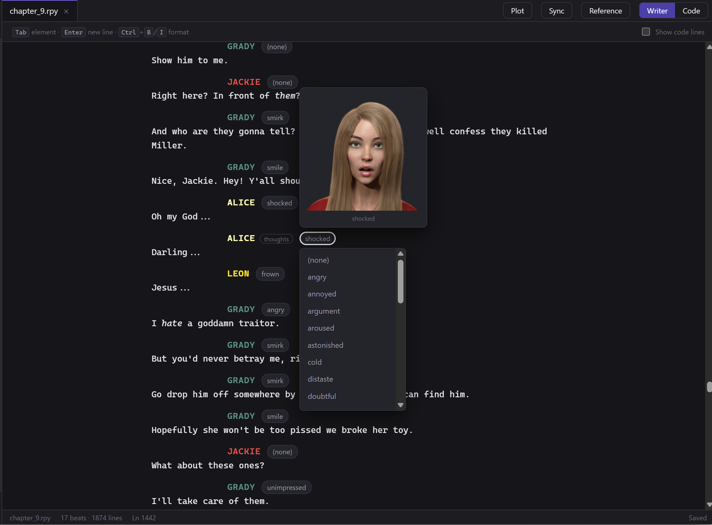
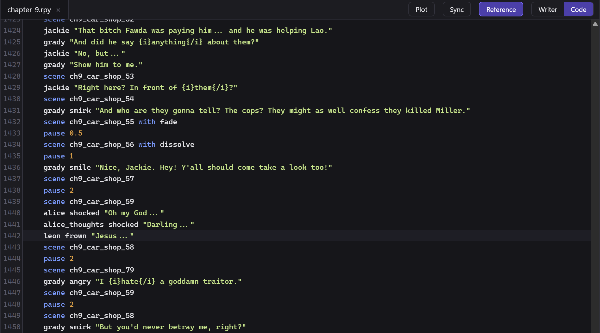
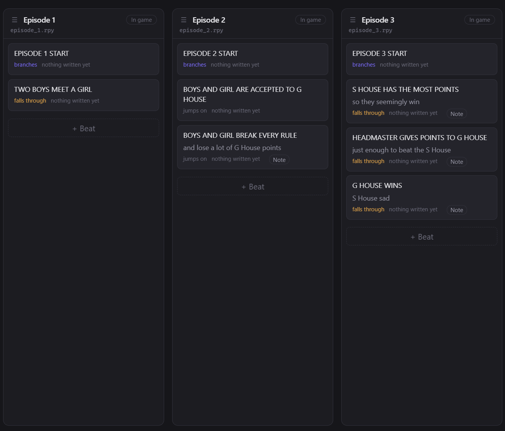
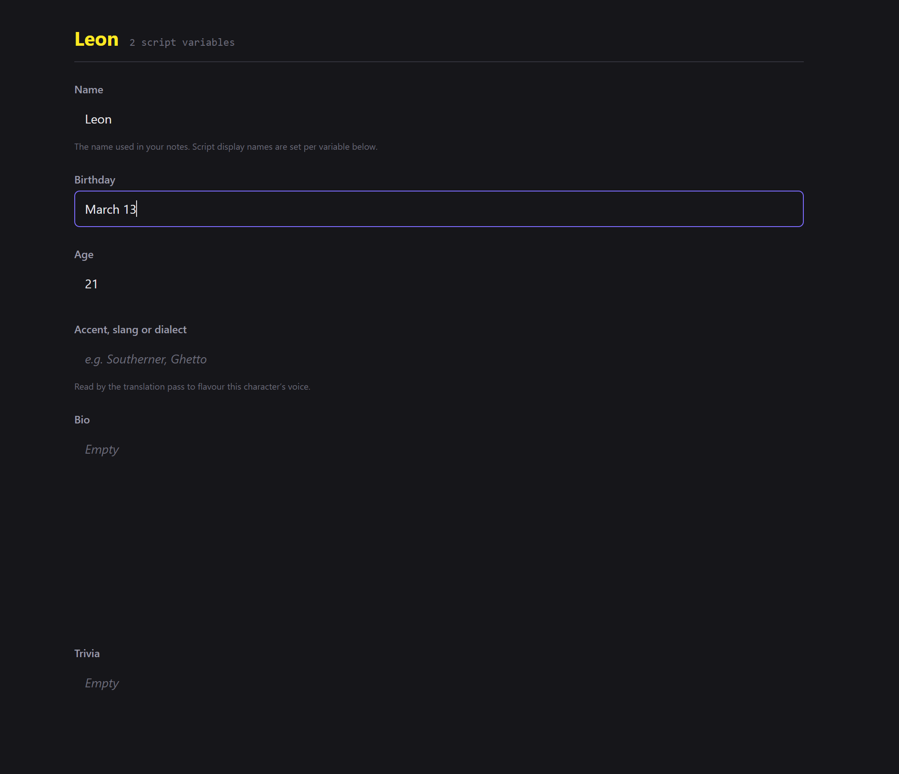

# Ren'Py Writer

## Why

Writing a story in a code editor is both inefficient and ugly.

In Ren'Py Writer (RW), you can view and edit files in two modes, code mode (as
you know from code editor), and writer mode, where you can write your script as
a screenplay - you have speaker cues, dialogue, stage directions - and it is
saved back as an ordinary `.rpy` file.

## Features

- Write in screenplay form instead of code
- See your story as an outline of scenes you can reorder
- Keep notes on characters, places and anything else, beside the script
- Work with someone else on the same story without treading on each other
- Copy images into your Ren'Py project and convert them to WebP
- Proofread/Translate in app (requires local AI (claude) setup)
- Support for running as a web application, so you can edit your script from
anywhere, even your phone (requires a server setup and domain though)

## Design philosophy

Rather than support all possible game implementations, RW is somewhat opinionated app designed
to support basic VN templates.

Games with more gameplay mechanisms like phone games or sandbox games might need some tweaking.
Feel free to fork the repo and customize RW for your project.

### What it does to your files (hehe)

**What it touches.** (hehe) The `.rpy` files you open and edit. A folder called
`.renpywriter/` that it creates in your project, holding the outline, character
profiles, notes and any drafts. Images, but only when you ask it to bring
artwork in. Nothing else in your project is ever written to.

**When it touches them.** (hehehe) A second or so after you stop typing, and when you
switch away to something else. Never on its own in the background.

**How it touches them.** (hehehehe) Only the lines you actually changed are rewritten.
Every other line goes back exactly as it was, character for character —
including menus, conditions, screens and custom code the editor does not
understand, and including invisible things like line endings. Open a script,
change one line of dialogue, save: the rest of the file is byte for byte what it
was before.

## Setting it up

**Windows** - double-click **`install.cmd`**

**macOS or Linux** - double-click **`install.sh`**, or open a terminal in this
folder and run `./install.sh`

It takes a few minutes, mostly downloading. When it finishes you will have a
**Ren'Py Writer** shortcut on your desktop, and one in this folder.

If something goes wrong, running setup again is safe - it picks up where it got
to. To remove everything it added, delete this folder.

Then open the app and point it at your game - the folder containing `game/`. It
works out the rest.

## What it does

### Writing

Your script, as a screenplay. Character cues in their own colours, taken from
the way you defined them. Dialogue you can just type. Stage directions in
italics. Bold, italics and text size where you need them.

Type the first letters of a character's name and it completes it. Where a
character has portraits, their expressions are offered as you write, with
previews.

### The outline

Every scene in your story as a card you can move. Reorder them, move one to a
different chapter, or park it as a draft until it is ready - drafts stay out of
the game folder, so a half-written scene never reaches your players.

### Characters, places and notes

Profiles for your cast, with notes and locations alongside them, so you have all
the information in one place. Mention a character or place in a note and it becomes
a link.

Renaming someone's display name updates your script.

### Working with other people

If your project is in version control:

Saving your work and sharing it is one button; **Bring in changes** takes in what
somebody else did. When both of you changed the same lines, it shows you both
versions and asks which to keep. Nothing is written until you have decided.

### Pictures

Point an episode (episode is a single .rpy file, your release can technically
have multiple episodes/chapters/whatever) at the folder where your artwork comes
out, and the app copies in what is new or has changed since last time, converting
it to the WebP format. It skips whatever is already up to date.

The pictures show up as a preview in the code editor if you hover over them.

### Proofreading and translation

The app can read through a chapter and suggest corrections, or translate it,
showing you every proposed change with the original beside it so you can accept
or reject each one. It leaves alone any line already in the other language.

This needs a local AI setup of your own, and is off unless you configure it.
Everything else works without it.

### Writing from a web app (a PC without the project files, or a phone/tablet)

There is a way to run Ren'Py Writer on a machine of your own and reach it from a
phone or a browser, with a layout made for a small screen. It is genuinely more
work than the rest of this and is meant for people who want it badly.

See **[docs/web.md](docs/web.md)**.

## Contributing

**Changes are welcome.** If you have fixed something, or added something that
fits what the app is for, open a pull request.

By sending a change you agree it can be used under the same licence as the rest,
including in any paid hosted version the author may offer.

## Licence

**[PolyForm Noncommercial 1.0.0](LICENSE)** - use it, change it, share it, for
any noncommercial purpose. You may not sell it, or sell a modified version, or
sell a service built on it.

**Making a commercial game with this tool is totally fine.**
